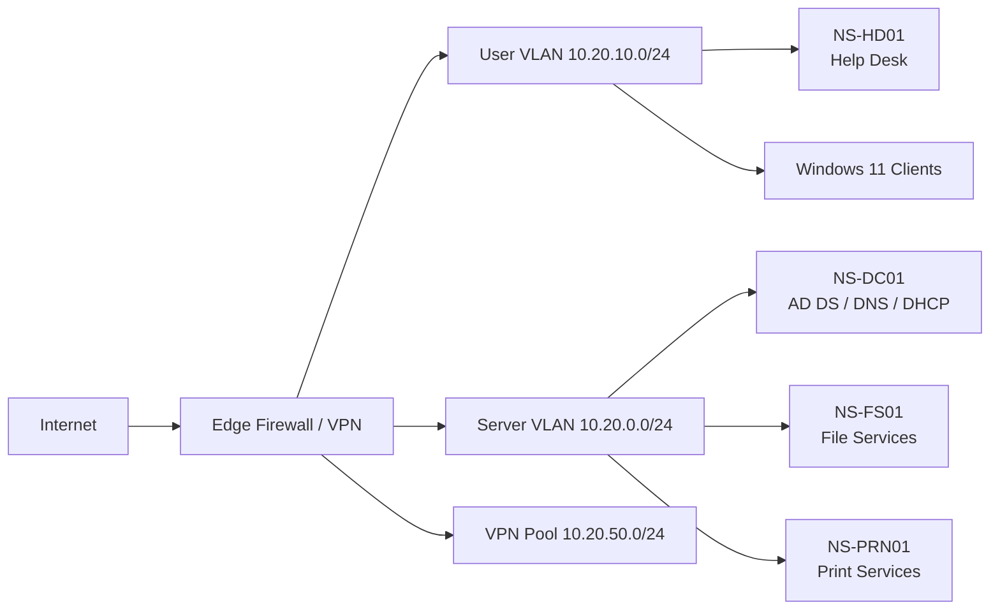

# Network and Domain Design

## Core records

| Host | Address | Role |
|---|---:|---|
| NS-DC01 | 10.20.0.10 | AD DS, DNS, DHCP |
| NS-FS01 | 10.20.0.20 | Department shares and home folders |
| NS-PRN01 | 10.20.0.30 | Printer queues and drivers |
| NS-HD01 | 10.20.10.25 | Help desk administration workstation |

## DNS design

- Forward lookup zone: `northstar.local`
- Reverse lookup zones: `10.20.0.0/24`, `10.20.10.0/24`
- Clients use only `10.20.0.10` for internal DNS.
- The domain controller forwards external queries to approved upstream resolvers.

## DHCP scope

- Scope: `10.20.10.50` through `10.20.10.220`
- Exclusions: `10.20.10.1` through `10.20.10.49`
- Router option: `10.20.10.1`
- DNS option: `10.20.0.10`
- DNS suffix: `northstar.local`
- Lease duration: 8 days
