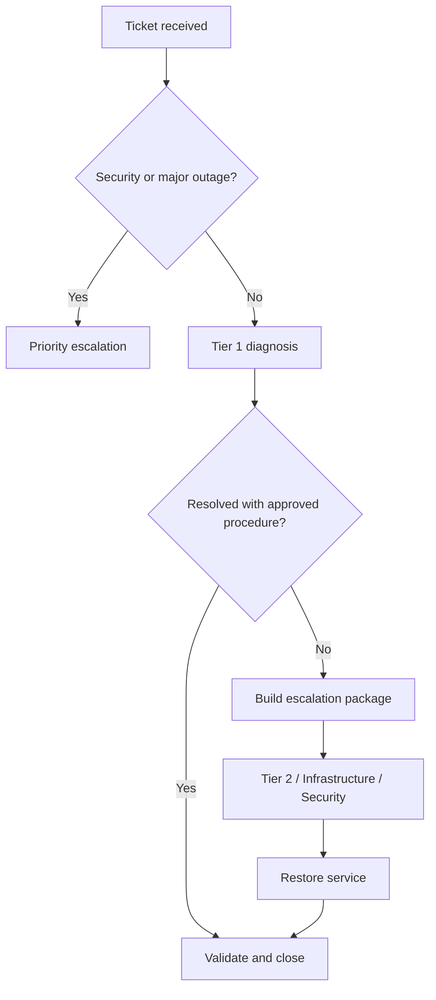

# Escalation Flow

```mermaid
flowchart TD
A[Ticket received] --> B{Security or major outage?}
B -- Yes --> C[Priority escalation]
B -- No --> D[Tier 1 diagnosis]
D --> E{Resolved with approved procedure?}
E -- Yes --> F[Validate and close]
E -- No --> G[Build escalation package]
G --> H[Tier 2 / Infrastructure / Security]
H --> I[Restore service]
I --> F
```
