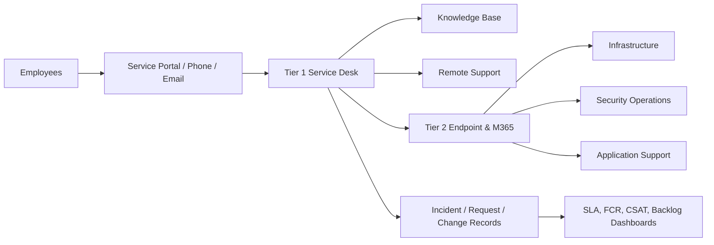

# Support Architecture

```mermaid
flowchart LR
U[Employees] --> P[Service Portal / Phone / Email]
P --> T1[Tier 1 Service Desk]
T1 --> KB[Knowledge Base]
T1 --> R[Remote Support]
T1 --> T2[Tier 2 Endpoint & M365]
T2 --> I[Infrastructure]
T2 --> S[Security Operations]
T2 --> A[Application Support]
T1 --> ITSM[Incident / Request / Change Records]
ITSM --> KPI[SLA, FCR, CSAT, Backlog Dashboards]
```
